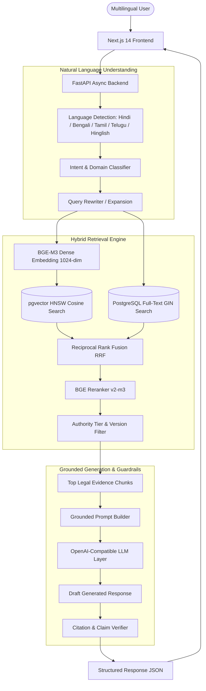

# IP-SAKTI Sahayak (आईपी-शक्ति सहायक)
### Multilingual RAG-Based IP & Regulatory Guidance Assistant for India

[](https://fastapi.tiangolo.com)
[](https://nextjs.org)
[](https://github.com/pgvector/pgvector)
[](https://huggingface.co/BAAI/bge-m3)
[](https://opensource.org/licenses/MIT)

---

## 🏛️ Core Product Philosophy

> **THE LLM EXPLAINS. THE VERIFIED STATUTORY KNOWLEDGE BASE PROVIDES THE EVIDENCE.**

IP-SAKTI Sahayak is a **citation-first legal RAG assistant** designed to help Indian citizens, innovators, startups, and MSMEs understand Intellectual Property (IP) laws and regulatory frameworks in their native language (English, Hindi, Bengali, Tamil, Telugu, and Hinglish).

Every legal claim is strictly grounded in authoritative Government of India statutory sources (IP India, CGPDTM, Copyright Office, DPIIT, MeitY). Hallucinations are actively prevented using confidence scoring and automatic low-evidence fallbacks.

---

## 📐 Architecture



---

## ✨ Winning Hackathon Features

1. **Multilingual RAG**: Native support for English, Hindi, Bengali, Tamil, Telugu, and Hinglish.
2. **Hybrid Retrieval**: Combines pgvector dense semantic embeddings with PostgreSQL full-text search using Reciprocal Rank Fusion (RRF).
3. **Exact Legal Citation**: Direct link mapping to official Act, Chapter, Section, Rule, and Gazette provisions.
4. **"Why This Answer?" Transparency Panel**: Inspect why the AI arrived at its conclusion, including authority tier, status (CURRENT vs HISTORICAL), and retrieved excerpts.
5. **"What Protects My Idea?" Discovery Wizard**: Step-by-step guidance mapping novel ideas to Patents, Trademarks, Copyrights, or Designs.
6. **Side-by-Side IP Comparison**: Interactive comparison matrix for Indian IP assets.
7. **Document Upload & Cross-Analysis**: Ephemeral analysis of user IP notices or drafts against official statutory provisions with strict privacy guardrails.
8. **100-Question Evaluation Benchmark**: Curated evaluation suite measuring Recall@5, MRR, classification accuracy, and latency.

---

## 🛠️ Technology Stack

| Layer | Technology |
|---|---|
| **Frontend** | Next.js 14, React 18, TypeScript, Tailwind CSS, Lucide Icons |
| **Backend** | Python 3.11, FastAPI, Pydantic v2, SQLAlchemy 2.0 (Async), Alembic |
| **Database** | PostgreSQL 16 + pgvector (HNSW indexing) + PostgreSQL Full Text Search |
| **Embeddings** | `BAAI/BGE-M3` (1024-dimensional multilingual dense vectors) |
| **Reranker** | `BAAI/bge-reranker-v2-m3` |
| **LLM Layer** | OpenAI-Compatible LLM (GPT-4o, GPT-5.6 Luna adapter) |
| **PDF Processing** | PyMuPDF, pdfplumber, Tesseract OCR for scanned gazettes |
| **DevOps** | Docker, Docker Compose, Health Checks |

---

## 🚀 Quick Start (Docker Compose)

The easiest way to run the entire stack is with Docker Compose:

```bash
# 1. Clone the repository and navigate to folder
cd ip-sakti

# 2. Copy and configure environment variables
cp .env.example .env
# Edit .env and set your OPENAI_API_KEY

# 3. Start all services (PostgreSQL, pgvector, MinIO, Backend, Frontend)
docker compose up -d

# 4. Open the Web Application
# Frontend: http://localhost:3000
# Backend API Docs: http://localhost:8000/docs
```

---

## 💻 Local Development Setup

### 1. Backend Setup
```bash
cd backend
python -m venv venv
source venv/bin/activate  # On Windows: venv\Scripts\activate
pip install -r ../requirements.txt

# Run migrations
alembic upgrade head

# Start FastAPI dev server
uvicorn app.main:app --reload --port 8000
```

### 2. Frontend Setup
```bash
cd frontend
npm install
npm run dev
```

### 3. Ingest Statutory Knowledge Sources
```bash
# Ingest official sources from registry
python scripts/ingest.py

# Run RAG benchmark evaluation
python scripts/evaluate.py
```

---

## 📊 Evaluation & Verification

To run the automated RAG evaluation benchmark:
```bash
python scripts/evaluate.py
```
This tests all 100 questions in `data/benchmark/questions.json` and outputs Recall@5, MRR, domain accuracy, and latency metrics.

---

## ⚖️ Legal Disclaimer

*IP-SAKTI Sahayak is an educational and informational AI assistant powered by official Government of India public documents. It does not provide legal advice or legal representation. For specific legal matters, consult a qualified Intellectual Property attorney or the relevant statutory authority.*

---

## 📜 License
MIT License. Free for open-source innovation and public research.
