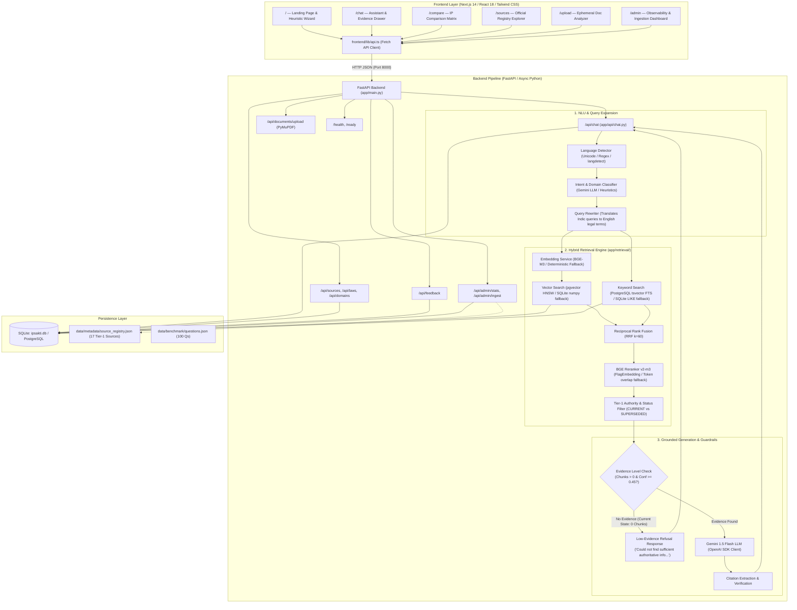
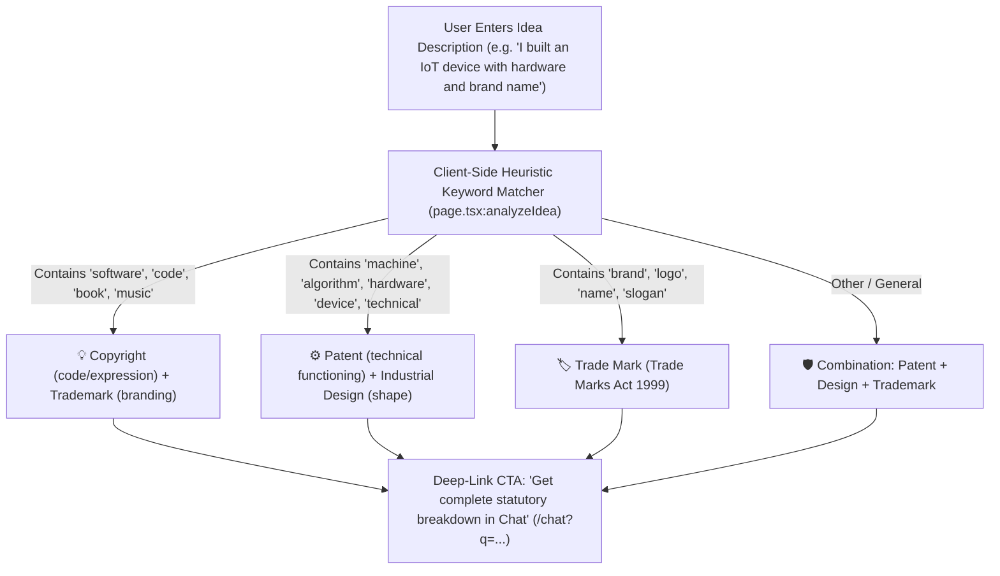
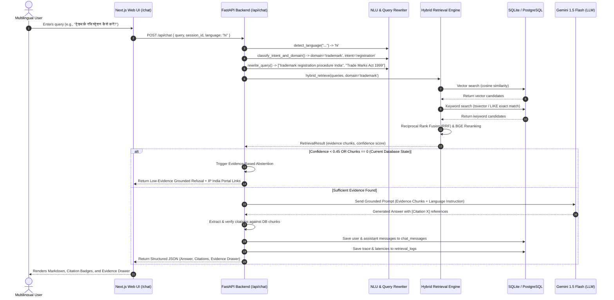

# IP-SAKTI Sahayak — Technical Blueprint

## 1. Project Overview

### Project Identity & Problem Statement
* **Project Name**: IP-SAKTI Sahayak
* **Problem Statement**: SIH26045 — *IP-SAKTI Sahayak: A multilingual, RAG-based (source-cited) AI assistant for Intellectual Property and regulatory guidance in Ayurveda, across national and international regimes.*
* **Theme**: MedTech / BioTech / HealthTech
* **Category**: Software
* **Core Philosophy**: *"The AI explains, but the verified sources provide the evidence."*

---

### What the Project Currently Is
The existing codebase is a **working full-stack prototype** consisting of:
1. A **Next.js 14 (React 18 + TypeScript + Tailwind CSS)** frontend web application.
2. A **FastAPI (Python 3.10+ / Async SQLAlchemy)** backend server.
3. An **algorithmic RAG pipeline** featuring language detection, intent classification, query rewriting, hybrid retrieval (vector similarity + full-text search), reranking, grounded answer generation, and evidence-based abstention.
4. An **SQLite local database (`ipsakti.db`)** (with PostgreSQL / pgvector support configured).
5. A **Source Registry metadata catalog** (`data/metadata/source_registry.json`) indexing 17 Tier-1 Indian statutory instruments (Patents Act, Trademarks Act, Copyright Act, Designs Act, GI Act, DPDP Act, Startup India, etc.).
6. A **100-question automated evaluation benchmark** (`data/benchmark/questions.json`).

---

### Current Development Stage
* **Overall Status**: **Functional Architectural Prototype with Unpopulated Knowledge Corpus**
* **Frontend**: **Implemented & Fully Functional** (UI, Dark/Light theme, Chat, Comparison Matrix, Source Explorer, Document Upload, Admin Dashboard).
* **Backend API**: **Implemented & Fully Functional** (All 14 endpoints active and connected to frontend services).
* **AI & LLM Layer**: **Connected & Functional** (Integrated with Gemini 1.5 Flash via OpenAI-compatible endpoint).
* **RAG Pipeline Engine**: **Implemented in Code**, but currently operating in **Abstention Mode** because the local database (`ipsakti.db`) has **0 documents and 0 chunks ingested**.
* **Domain Corpus**: Currently structured for **General Indian Intellectual Property Law** (Patents, Trademarks, Copyright, Designs, GI, SICLD, DPDP). **Ayurveda, Biological Diversity Act, TKDL (Traditional Knowledge Digital Library), and International IP Regimes are NOT YET indexed in the knowledge base.**

---

### Difference Between Current Prototype and Future Vision

| Dimension | Current Implementation | Target Vision (SIH26045) |
|---|---|---|
| **Domain Scope** | General Indian IP (Patents, TM, Copyright, Design, GI, DPDP) | Specialized Ayurveda, Traditional Knowledge, Bio-patentability & General IP |
| **Ayurveda / TKDL** | Planned / Not yet in Source Registry | Comprehensive ingestion of TKDL guidelines, AYUSH regulations, Biodiversity Act 2002 |
| **Jurisdictions** | National (India only) | Dual-regime: National (India / IP India) + International (WIPO, US PTO, EPO, Madrid, PCT) |
| **Knowledge Base** | Empty SQLite DB (`chunks` count = 0) | Fully indexed PostgreSQL + pgvector corpus with tens of thousands of verified legal chunks |
| **Embeddings** | Fallback SHA-256 projection in CPU `.venv` (due to missing `FlagEmbedding` wheel) | GPU-accelerated local BAAI/BGE-M3 (1024-dim) dense vector embeddings |
| **Idea Protection Wizard** | Client-side rule-based keyword matching | AI-driven statutory route mapper evaluating novelty, prior art & biodiversity clearance |
| **Authentication** | Disabled / Public endpoints | Role-based access control (General User, Startup, IP Attorney, Admin) with JWT |

---

## 2. Current Project Architecture



---

## 3. Complete Technology Stack

| Technology | Category | Where Used | Status | How It Works |
|---|---|---|---|---|
| **Next.js (14.2.11)** | Frontend Framework | `frontend/` | **Implemented** | Handles App Router pages (`/`, `/chat`, `/compare`, `/sources`, `/upload`, `/admin`), server/client component rendering, and asset optimization. |
| **React (18.3.1)** | UI Library | `frontend/` | **Implemented** | State management (`useState`, `useEffect`, `useRef`), interactive forms, dynamic chat thread, and responsive UI components. |
| **TypeScript (5.5.4)** | Language | `frontend/` | **Implemented** | Strong typing across API responses, messages, evidence traces, citations, and DOM events (`types/index.ts`). |
| **Tailwind CSS (3.4.11)** | Styling Framework | `frontend/` | **Implemented** | Utility-first styling with dark/light mode switching (`globals.css`, `tailwind.config.js`). |
| **Lucide Icons (0.441.0)** | UI Icons | `frontend/` | **Implemented** | Provides scalable iconography across navigation, status badges, evidence pills, and buttons. |
| **React Markdown (9.0.1) & Remark GFM** | Rich Text Parser | `frontend/app/chat/page.tsx` | **Implemented** | Renders structured markdown responses (bolding, headers, lists, tables) returned by the AI assistant. |
| **FastAPI (0.115.0 / 0.141.1 in venv)** | Backend Framework | `backend/app/main.py` | **Implemented** | Async REST API server exposing chat, search, documents, sources, admin, and health endpoints. |
| **Uvicorn (0.30.6 / 0.52.4 in venv)** | ASGI Web Server | `backend/` | **Implemented** | High-performance asynchronous HTTP server running FastAPI on `0.0.0.0:8000`. |
| **Pydantic (2.9.2 / 2.13.5 in venv)** | Data Validation | `backend/app/schemas/` | **Implemented** | Enforces strict schemas and data serialization for all API request and response payloads. |
| **Pydantic Settings (2.5.2)** | Configuration | `backend/app/config.py` | **Implemented** | Central configuration loader reading environment variables from `.env` with fallback defaults. |
| **SQLAlchemy (2.0.35 / 2.0.52 in venv)** | ORM & DB Engine | `backend/app/database.py`, `models/` | **Implemented** | Async ORM managing 13 database tables, session lifecycles, connection pooling, and multi-dialect compatibility. |
| **SQLite (`aiosqlite`)** | Local Database | `ip-sakti/ipsakti.db` | **Implemented & Active** | Default local asynchronous file database storing chat sessions, messages, retrieval logs, and feedback. |
| **PostgreSQL (16)** | Target Vector DB | `docker-compose.yml`, `sql/init.sql` | **Configured Only** | Docker service defined with `pgvector/pgvector:pg16` image; ready for deployment but not currently running in active local `.env`. |
| **pgvector (0.3.2 / 0.5.0 in venv)** | Vector Extension | `backend/app/models/models.py` | **Partially Implemented** | SQLAlchemy model defines `Vector(1024)` with SQLite `JSON` fallback variant. Works when PostgreSQL is connected. |
| **PyMuPDF (`fitz` 1.28.2)** | PDF Extraction | `backend/app/ingestion/pdf_extractor.py` | **Implemented** | Extracts raw text from official PDF gazettes and user-uploaded documents page-by-page. |
| **pdfplumber (0.11.10)** | Document Parsing | `backend/` | **Implemented** | Installed in virtual environment as secondary legal table and document extraction utility. |
| **pytesseract / Tesseract OCR** | OCR Fallback | `backend/app/ingestion/pdf_extractor.py` | **Partially Implemented** | Code contains OCR rendering at 300 DPI for scanned PDFs; requires external Tesseract binary on the host OS. |
| **OpenAI Python SDK (3.8.0)** | LLM API Client | `backend/app/llm/generator.py` | **Implemented** | Communicates with Gemini 1.5 Flash via Google's OpenAI-compatible endpoint (`https://generativelanguage.googleapis.com/v1beta/openai/`). |
| **BAAI/BGE-M3** | Dense Embedding Model | `backend/app/services/embedding_service.py` | **Partially Implemented** | Architecture designed for 1024-dim vectors. Code includes automatic deterministic SHA-256 fallback when `FlagEmbedding` is absent. |
| **BAAI/bge-reranker-v2-m3** | Cross-Encoder Reranker | `backend/app/services/reranker_service.py` | **Partially Implemented** | Architecture designed for reranking candidate passages. Fallback to token overlap scoring is active. |
| **Langdetect (1.0.9) & Langid (1.1.6)** | Language Detection | `backend/app/multilingual/language_detector.py` | **Implemented** | Detects Indic languages (Hindi, Bengali, Tamil, Telugu) and Hinglish alongside Unicode script regex matching. |
| **Docker & Docker Compose** | Containerization | `docker-compose.yml`, `Dockerfile` | **Configured Only** | Full multi-container configuration (PostgreSQL + pgvector, MinIO, FastAPI Backend, Next.js Frontend) defined. |
| **MinIO (7.2.9)** | S3 Object Storage | `docker-compose.yml`, `config.py` | **Configured Only** | S3-compatible document storage configured in settings; default local storage path (`./data/raw`) used in development. |
| **Alembic (1.13.3 / 1.19.1 in venv)** | DB Migrations | `backend/alembic/` | **Implemented** | Migration environment and configuration files present for schema evolution. |
| **Rich (15.0.0) & Click (8.5.0)** | CLI & Ingestion Tools | `scripts/ingest.py`, `scripts/evaluate.py` | **Implemented** | Powers command-line ingestion, evaluation runners, and terminal reporting tables. |

---

## 4. Frontend Architecture

### Framework & Environment
* **Framework**: Next.js 14.2.11 (App Router architecture)
* **Runtime**: Node.js v20+ with React 18.3.1
* **Language**: TypeScript 5.5.4
* **Styling**: Tailwind CSS 3.4.11 with custom scrollbars, CSS variables, and dark mode class strategy (`class`).

---

### Routing Structure
The frontend defines 6 active routes inside `frontend/app/`:

| Route | Page File | Purpose & Implemented Features |
|---|---|---|
| `/` | `frontend/app/page.tsx` | **Landing Page**: Hero section, dynamic language selector chips (English, Hindi, Bengali, Tamil, Telugu, Hinglish), natural language search form, suggested question chips, **"What Protects My Idea?"** heuristic discovery card, 3 Core value cards, and 4 quick-link feature cards. |
| `/chat` | `frontend/app/chat/page.tsx` | **AI Guidance Hub**: Session-based conversation thread, domain filter bar, message history, streaming loading state, high/moderate/low evidence badge rendering, Markdown formatting, official citation pills with external PDF links, copy button, Text-to-Speech (Web Speech API), feedback buttons (+1/-1), and a collapsible right-hand **"Source Evidence"** inspector drawer. |
| `/compare` | `frontend/app/compare/page.tsx` | **IP Comparison Matrix**: Comprehensive matrix table comparing Patents, Trademarks, Copyrights, and Industrial Designs across 6 key dimensions (What it protects, Governing statute, Term of protection, Registration requirement, Authority, Startup fee rebates). |
| `/sources` | `frontend/app/sources/page.tsx` | **Official Source Explorer**: Searchable and domain-filterable catalog of official Indian legal sources with direct links to government portals. |
| `/upload` | `frontend/app/upload/page.tsx` | **Document Cross-Analysis**: File upload interface (PDF/TXT up to 50MB), privacy guardrail notice, in-memory text preview, and related statutory provision retrieval. |
| `/admin` | `frontend/app/admin/page.tsx` | **Observability & Ingestion Hub**: Real-time metrics cards (Indexed documents, Legal chunks, Average response time, Feedback rate), domain chunk distribution list, recent ingestion pipelines table, and trigger buttons for background ingestion. |

---

### Key Components

```
frontend/components/
├── Navbar.tsx         # Sticky navigation header with branding, route links, ThemeToggle, and 'Ask Sahayak' CTA
├── Footer.tsx         # Comprehensive footer with legal disclaimer, quick links, statutory portal links, and copyright
├── ThemeProvider.tsx  # React context provider managing dark/light theme persistence in localStorage
└── ThemeToggle.tsx    # Accessible toggle button switching between dark and light modes
```

---

### State Management
* **Chat Messages**: Managed locally in `ChatPage` via React `useState<ChatMessage[]>([])` and persisted per session on the backend.
* **Session Tracking**: Auto-generates unique session IDs (`session_<timestamp>_<random>`) stored in component state.
* **Loading & Busy States**: Tracked per action (`isLoading`, `isTriggering`) with animated spinners.
* **User Selections**: Language and domain filters stored in React state and synchronized via URL query parameters (`/chat?q=...&lang=...`).
* **Evidence Inspection**: Selected assistant response's evidence chunks are passed into `selectedEvidence` state and rendered in the right-hand sidebar.
* **Theme State**: Handled via `ThemeProvider` applying `.dark` class to `document.documentElement` and writing to `localStorage.getItem('theme')`.

---

### API Communication Layer (`frontend/lib/api.ts`)
The frontend communicates directly with the backend REST API via standard browser `fetch` calls:
* Base URL configured via `process.env.NEXT_PUBLIC_API_URL || 'http://localhost:8000'`.
* Implemented client functions:
  - `sendChatMessage(params)` $\rightarrow$ `POST /api/chat`
  - `fetchChatHistory(sessionId)` $\rightarrow$ `GET /api/chat/{sessionId}`
  - `fetchSources(domain)` $\rightarrow$ `GET /api/sources`
  - `fetchLaws(domain, docType)` $\rightarrow$ `GET /api/laws`
  - `submitFeedback(params)` $\rightarrow$ `POST /api/feedback`
  - `fetchAdminStats()` $\rightarrow$ `GET /api/admin/stats`
  - `triggerIngestion(params)` $\rightarrow$ `POST /api/admin/ingest`
  - `uploadDocument(file)` $\rightarrow$ `POST /api/documents/upload` (Multipart `FormData`)

> **IMPORTANT VERIFICATION**: The frontend does NOT use fake mock JSON in `api.ts`. It makes real HTTP requests to the backend. When the backend has no indexed data, it faithfully displays the backend's low-evidence abstention response.

---

## 5. Backend Architecture

### Server Entry Point (`backend/app/main.py`)
* **Lifespan Context**: Initializes database extensions and warms up embedding services at startup.
* **Middleware**:
  1. `CORSMiddleware`: Configured from `settings.cors_origins_list` (`http://localhost:3000`, `http://127.0.0.1:3000`).
  2. `add_request_timing`: Attaches `X-Process-Time` latency header (in milliseconds) to every HTTP response.
  3. `log_requests`: Structured logging of HTTP method, path, client IP, and status code.
* **Exception Handlers**: Custom JSON handlers for 404 (Not Found) and 500 (Internal Server Error).

---

### Implemented API Endpoints Table

| Endpoint | Method | Purpose | Frontend Connected? | Status | Evidence File |
|---|---|---|---|---|---|
| `/health` | `GET` | Service liveness check | Yes (Internal) | **Implemented** | `app/api/health.py:17` |
| `/ready` | `GET` | Dependency readiness check (DB & Embedding model) | Yes (Internal) | **Implemented** | `app/api/health.py:29` |
| `/api/chat` | `POST` | Primary RAG endpoint: multilingual question answering | **Yes** (`api.ts:12`) | **Implemented** | `app/api/chat.py:31` |
| `/api/chat/{session_id}` | `GET` | Fetch chronological message history for a session | **Yes** (`api.ts:44`) | **Implemented** | `app/api/chat.py:229` |
| `/api/search` | `POST` | Hybrid vector + full-text search over knowledge base | **Yes** (Admin/Search) | **Implemented** | `app/api/endpoints.py:31` |
| `/api/sources` | `GET` | List active registered knowledge sources | **Yes** (`api.ts:50`) | **Implemented** | `app/api/endpoints.py:81` |
| `/api/sources/{source_id}` | `GET` | Get detailed metadata for a single source | Available | **Implemented** | `app/api/endpoints.py:96` |
| `/api/domains` | `GET` | List supported IP domains with descriptions | **Yes** (`api.ts:56`) | **Implemented** | `app/api/endpoints.py:104` |
| `/api/laws` | `GET` | List indexed Acts, Rules, Manuals, and Gazettes | **Yes** (`api.ts:60`) | **Implemented** | `app/api/endpoints.py:122` |
| `/api/feedback` | `POST` | Record user feedback (+1 / -1) and comments | **Yes** (`api.ts:72`) | **Implemented** | `app/api/endpoints.py:161` |
| `/api/documents/upload` | `POST` | Ephemeral PDF/TXT extraction & statutory matching | **Yes** (`api.ts:98`) | **Implemented** | `app/api/endpoints.py:184` |
| `/api/admin/stats` | `GET` | Observability stats (doc count, chunks, latency) | **Yes** (`api.ts:81`) | **Implemented** | `app/api/endpoints.py:279` |
| `/api/admin/ingest` | `POST` | Trigger background source ingestion pipeline | **Yes** (`api.ts:87`) | **Implemented** | `app/api/endpoints.py:343` |
| `/api/admin/ingestion/jobs` | `GET` | List recent ingestion job runs and error logs | Available | **Implemented** | `app/api/endpoints.py:367` |

---

### Request & Response Models (`backend/app/schemas/schemas.py`)
All endpoints enforce typed Pydantic v2 schemas:
* `ChatRequest`: `query` (1–2000 chars), `session_id`, `language`, `domain`, `include_trace`.
* `ChatResponse`: `session_id`, `message_id`, `answer`, `language`, `domain`, `intent`, `confidence`, `evidence_level`, `citations`, `evidence`, `warnings`, `retrieval_trace_id`, `has_sufficient_evidence`, `retrieval_latency_ms`, `total_latency_ms`.
* `CitationResponse`: `citation_number`, `document_title`, `section_no`, `rule_no`, `chapter`, `page_number`, `authority`, `source_url`, `status`, `is_current`.
* `EvidenceTrace`: `chunk_id`, `document_title`, `section_no`, `rule_no`, `chapter`, `domain`, `authority`, `authority_tier`, `source_url`, `page_number`, `status`, `reranker_score`, `content_preview`.

---

## 6. Current Chat / AI System

### Technical Verification Summary

#### A. Real AI / LLM
* **Status**: **IMPLEMENTED & CONNECTED**
* **Evidence**: `backend/app/llm/generator.py:253-275`
* **Details**: Uses `openai.AsyncOpenAI` configured with Gemini 1.5 Flash via `OPENAI_API_BASE=https://generativelanguage.googleapis.com/v1beta/openai/` and `OPENAI_API_KEY` set in `.env`.

#### B. Mock Responses
* **Status**: **NOT A STATIC MOCK**
* **Evidence**: `backend/app/llm/generator.py:200-222`
* **Details**: The system does not return hardcoded responses for specific questions. Instead, it runs the real retrieval pipeline. Because the database currently contains **0 chunks**, the retrieval confidence is $0.0$, which triggers the **evidence-based abstention response**:
  ```
  "I could not find sufficient authoritative information in the current knowledge base to reliably answer this question..."
  ```

#### C. Query Matching & NLU
* **Status**: **IMPLEMENTED**
* **Evidence**: `backend/app/multilingual/intent_classifier.py:75-135`, `backend/app/multilingual/language_detector.py:51-149`
* **Details**: Combines fast regex/Unicode script matching and keyword heuristics with an LLM structured-output classifier (`gpt-4o` / `gemini-1.5-flash`) for intent and domain classification.

#### D. Backend Communication
* **Status**: **IMPLEMENTED & VERIFIED**
* **Evidence**: `frontend/lib/api.ts:12-40`, `backend/app/api/chat.py:31`
* **Details**: Chat requests flow from the React UI to `/api/chat`, save sessions in `chat_sessions`, record retrieval traces in `retrieval_logs`, and append messages to `chat_messages`.

#### E. Failure Handling
* **Status**: **IMPLEMENTED**
* **Evidence**: `backend/app/llm/generator.py:276-285`
* **Details**: If the LLM call fails or times out, the backend executes `_fallback_evidence_summary()` to return raw extracted evidence passages directly to the user with a disclaimer, avoiding a total failure.

---

### Step-by-Step Query Execution Flow

```
User enters question in /chat (e.g., in Hindi or English)
   │
   ▼
[Step 1: Language Detection] (app/multilingual/language_detector.py)
   ├─ Checks Devanagari, Bengali, Tamil, Telugu, and Latin Unicode ranges
   └─ Detects Hinglish keyword patterns -> returns ISO code (e.g., 'hi', 'bn', 'en', 'mixed')
   │
   ▼
[Step 2: Session Persistence] (app/api/chat.py:57)
   └─ Gets or generates UUID session in `chat_sessions` table
   │
   ▼
[Step 3: Intent & Domain Classification] (app/multilingual/intent_classifier.py)
   ├─ Identifies domain: 'patent', 'trademark', 'copyright', 'design', 'gi', etc.
   └─ Identifies intent: 'registration', 'fees', 'eligibility', 'timeline', etc.
   │
   ▼
[Step 4: Query Rewriting] (app/multilingual/query_rewriter.py)
   └─ Generates 3–5 English statutory search terms for cross-lingual retrieval
   │
   ▼
[Step 5: Hybrid Retrieval] (app/retrieval/hybrid_retrieval.py)
   ├─ Dense vector search (BGE-M3 1024-dim embedding / pgvector)
   ├─ Exact section/rule regex matching (e.g., "Section 3", "Rule 23")
   ├─ Full-text search (tsvector / LIKE fallback)
   ├─ Reciprocal Rank Fusion (RRF k=60)
   └─ BGE cross-encoder reranking
   │
   ▼
[Step 6: Evidence & Confidence Evaluation]
   ├─ If evidence == 0 OR confidence < 0.45:
   │    └─ RETURN Low-Evidence Abstention Response (No Hallucination)
   └─ If evidence >= 1 AND confidence >= 0.45:
        └─ Construct Grounded Prompt -> Call Gemini 1.5 Flash -> Extract Verified Citations
   │
   ▼
[Step 7: Database Logging & Client Response]
   ├─ Insert user message and assistant response into `chat_messages`
   ├─ Record trace latencies and evidence chunk IDs in `retrieval_logs`
   └─ Send structured JSON with answer, citations, and evidence traces to Next.js UI
```

---

## 7. Source and Citation System

### Source Data Structure (`backend/app/models/models.py:114`)
* **ORM Entity**: `Source`
* **Fields**: `id`, `name`, `authority`, `authority_tier` (`TIER_1`, `TIER_2`, `TIER_3`), `domain`, `document_type`, `url`, `description`, `last_checked`, `is_active`, `created_at`.

### Citation Data Structure (`backend/app/schemas/schemas.py:23`)
* **Pydantic Model**: `CitationResponse`
* **Fields**: `citation_number` (int), `document_title` (str), `section_no` (str), `rule_no` (str), `chapter` (str), `page_number` (int), `authority` (str), `source_url` (str), `status` (str), `is_current` (bool).

### Evidence Trace Data Structure (`backend/app/schemas/schemas.py:37`)
* **Pydantic Model**: `EvidenceTrace`
* **Fields**: `chunk_id`, `document_title`, `section_no`, `rule_no`, `chapter`, `domain`, `authority`, `authority_tier`, `source_url`, `page_number`, `status`, `reranker_score`, `content_preview`.

### Storage & Attachment Method
1. **Catalog Definition**: 17 statutory instruments are declared in `data/metadata/source_registry.json`.
2. **Chunk Association**: When documents are ingested, each text chunk is stored in the `chunks` database table with its parent `document_id`, `section_no`, `rule_no`, `chapter`, `page_number`, `authority`, and `source_url`.
3. **LLM Prompting**: The system prompt injects retrieved evidence blocks labeled as `[Evidence 1]`, `[Evidence 2]`, etc., with explicit instruction: *"Every important legal claim must be supported by one or more retrieved citations marked as [Citation X]"*.
4. **Citation Extraction**: `_extract_citations_from_evidence()` maps the used evidence chunks into structured citation objects sent directly to the UI.

---

## 8. Current Knowledge Base

### Registered Statutory Instruments (`data/metadata/source_registry.json`)

| # | Source Name | Category | Authority | Authority Tier | Storage Method | Status in DB |
|---|---|---|---|---|---|---|
| 1 | The Patents Act, 1970 | Patent | IP India / CGPDTM | TIER_1 | JSON Catalog | Registered (0 Chunks) |
| 2 | The Patents Rules, 2003 | Patent | IP India / CGPDTM | TIER_1 | JSON Catalog | Registered (0 Chunks) |
| 3 | The Trade Marks Act, 1999 | Trademark | IP India / CGPDTM | TIER_1 | JSON Catalog | Registered (0 Chunks) |
| 4 | The Trade Marks Rules, 2017 | Trademark | IP India / CGPDTM | TIER_1 | JSON Catalog | Registered (0 Chunks) |
| 5 | The Copyright Act, 1957 | Copyright | Copyright Office / DPIIT | TIER_1 | JSON Catalog | Registered (0 Chunks) |
| 6 | The Copyright Rules, 2013 | Copyright | Copyright Office / DPIIT | TIER_1 | JSON Catalog | Registered (0 Chunks) |
| 7 | The Designs Act, 2000 | Design | IP India / CGPDTM | TIER_1 | JSON Catalog | Registered (0 Chunks) |
| 8 | The Designs Rules, 2001 | Design | IP India / CGPDTM | TIER_1 | JSON Catalog | Registered (0 Chunks) |
| 9 | The GI of Goods Act, 1999 | GI | GI Registry, IP India | TIER_1 | JSON Catalog | Registered (0 Chunks) |
| 10 | The GI of Goods Rules, 2002 | GI | GI Registry, IP India | TIER_1 | JSON Catalog | Registered (0 Chunks) |
| 11 | The SICLD Act, 2000 | SICLD | SICLD Registry | TIER_1 | JSON Catalog | Registered (0 Chunks) |
| 12 | Startup India Action Plan | Startup | DPIIT | TIER_1 | JSON Catalog | Registered (0 Chunks) |
| 13 | Digital Personal Data Protection Act, 2023 | Data Protection | MeitY | TIER_1 | JSON Catalog | Registered (0 Chunks) |
| 14 | Manual of Patent Practice and Procedure | Patent | IP India / CGPDTM | TIER_1 | JSON Catalog | Registered (0 Chunks) |
| 15 | Trade Mark Manual of Practice & Procedure | Trademark | IP India / CGPDTM | TIER_1 | JSON Catalog | Registered (0 Chunks) |
| 16 | IP India FAQ — Patents | Patent | IP India | TIER_1 | JSON Catalog | Registered (0 Chunks) |
| 17 | IP India FAQ — Trade Marks | Trademark | IP India | TIER_1 | JSON Catalog | Registered (0 Chunks) |

---

### Critical Gap Analysis against Problem Statement (SIH26045)
* **Biological Diversity Act, 2002 / 2023 Amendments**: **NOT FOUND** in registry or database.
* **Traditional Knowledge Digital Library (TKDL) Guidelines**: **NOT FOUND** in registry or database.
* **Ayurveda / AYUSH Regulatory Framework (Drugs & Cosmetics Act Chapter IV-A)**: **NOT FOUND** in registry or database.
* **International Regimes (PCT, Madrid System, WIPO, US PTO, EPO)**: **NOT FOUND** in registry or database.

---

## 9. Route Map / IP Protection Wizard

### Inspection of the "What Protects My Idea?" Tool (`frontend/app/page.tsx:70-84`)
The landing page includes a guided discovery card where users describe their creation.



### Technical Evaluation
* **Implementation Status**: **MOCK / CLIENT-SIDE HEURISTIC**
* **Logic**: Basic string matching (`lower.includes(...)`) executed entirely in the React browser runtime.
* **Future Upgrade Required**: Must be transitioned to a multi-turn backend route-mapping agent that asks sequential questions about patentability (Section 3(p) Traditional Knowledge exclusion, Section 3(k) software exclusion), prior disclosure, commercial readiness, and biodiversity clearances.

---

## 10. Database Status

### Feature Verification Matrix

| Database Feature | Status | Evidence Found |
|---|---|---|
| **SQLite (`aiosqlite`)** | **CONNECTED & USED** | `backend/app/database.py:27`, `.env:11`, `ipsakti.db` (264 KB on disk). |
| **Database Models** | **IMPLEMENTED** | `backend/app/models/models.py` defines 13 ORM classes (`User`, `Source`, `Document`, `DocumentVersion`, `DocumentSection`, `Chunk`, `LegalEntity`, `ChatSession`, `ChatMessage`, `RetrievalLog`, `Feedback`, `IngestionJob`, `SystemEvent`). |
| **PostgreSQL Database** | **CONFIGURED ONLY** | `docker-compose.yml:5` (pgvector:pg16 container), `backend/sql/init.sql`. Not connected in local development. |
| **pgvector Extension** | **CONFIGURED ONLY** | `backend/app/models/models.py:28` (`VectorType = Vector(1024).with_variant(JSON, "sqlite")`). |
| **Full-Text Search Index** | **CONFIGURED ONLY** | `backend/app/models/models.py:30` (`TSVectorType = TSVECTOR().with_variant(Text, "sqlite")`). SQLite uses fallback substring/word counting. |
| **Alembic Migrations** | **IMPLEMENTED** | `backend/alembic.ini`, `backend/alembic/env.py`. Tables are auto-created at startup via `Base.metadata.create_all`. |

---

### Database Row Counts in `ipsakti.db` (Verified via SQLite Inspector)

| Table Name | Row Count | Purpose / Notes |
|---|---|---|
| `sources` | **0** | Authoritative statutory sources (empty until ingestion is executed) |
| `documents` | **0** | Ingested legal documents (empty) |
| `document_versions` | **0** | Historical and current version records (empty) |
| `document_sections` | **0** | Chapters, parts, schedules (empty) |
| `chunks` | **0** | Legal text chunks + embeddings (**Critical: 0 rows is why AI abstains**) |
| `legal_entities` | **0** | Specific named statutory sections/rules (empty) |
| `chat_sessions` | **13** | Conversation session records from local tests |
| `chat_messages` | **30** | Historical user queries and assistant responses |
| `retrieval_logs` | **15** | Traces capturing query rewriting, candidate counts, and latencies |
| `feedback` | **1** | User feedback rating record |
| `users` | **0** | User accounts (authentication currently bypassed) |
| `ingestion_jobs` | **0** | Background ingestion job records |
| `system_events` | **0** | Audit log events |

---

## 11. RAG Implementation Status

### Component-by-Component Evaluation

| RAG Component | Status | Actual Implementation Details |
|---|---|---|
| **Document Ingestion** | **PARTIAL** | Complete async ingestion pipeline written in `app/ingestion/pipeline.py` and `scripts/ingest.py`, but has not been executed against the database. |
| **PDF Extraction** | **IMPLEMENTED** | `app/ingestion/pdf_extractor.py` uses PyMuPDF (`fitz`) to extract page-by-page text, strip null bytes, and normalize whitespace. |
| **OCR Fallback** | **PARTIALLY IMPLEMENTED** | `app/ingestion/pdf_extractor.py:167` renders pages at 300 DPI and calls `pytesseract.image_to_string`. Requires Tesseract binary on system. |
| **Legal Structure Parsing** | **IMPLEMENTED** | `app/ingestion/legal_parser.py` uses multi-line regex patterns detecting `CHAPTER`, `Section`, `Rule`, `Schedule`, `Form`, `Article`. |
| **Section-Aware Chunking** | **IMPLEMENTED** | `app/ingestion/chunker.py` chunks text into 500–1200 token blocks respecting section boundaries with 100-token overlap and SHA-256 hash deduplication. |
| **Dense Embeddings** | **PARTIALLY IMPLEMENTED** | `app/services/embedding_service.py` is configured for BAAI/BGE-M3 (1024-dim). When `FlagEmbedding` wheel is missing, it falls back to deterministic SHA-256 projection vectors. |
| **Vector Storage** | **PARTIALLY IMPLEMENTED** | Model supports `pgvector` in PostgreSQL and `JSON` array in SQLite. |
| **Vector Similarity Search** | **IMPLEMENTED** | `app/retrieval/vector_retrieval.py` executes cosine similarity search (`<=>`) in PostgreSQL or in-memory NumPy dot-product in SQLite. |
| **Full-Text Keyword Search** | **IMPLEMENTED** | `app/retrieval/keyword_retrieval.py` executes regex extraction for explicit section numbers (e.g. *"Section 3"*), plus PostgreSQL `tsvector` FTS or SQLite token matching. |
| **Hybrid Search Fusion** | **IMPLEMENTED** | `app/retrieval/hybrid_retrieval.py` unifies vector and keyword rankings using Reciprocal Rank Fusion ($RRF = \sum \frac{1}{60 + \text{rank}}$). |
| **Passage Reranking** | **PARTIALLY IMPLEMENTED** | `app/services/reranker_service.py` uses `bge-reranker-v2-m3` with token-overlap fallback. |
| **LLM Generation** | **IMPLEMENTED** | `app/llm/generator.py` formats retrieved evidence into strict system prompt and calls Gemini 1.5 Flash via OpenAI client. |
| **Citation Verification** | **IMPLEMENTED** | `app/llm/generator.py:154` constructs structured `Citation` objects directly from retrieved DB chunks. |
| **Evidence-Based Abstention** | **IMPLEMENTED & ACTIVE** | If retrieval confidence $< 0.45$ or chunks $= 0$, automatically returns refusal response with official portal links. |

---

## 12. Multilingual Support

### Language Support Matrix

| Language | UI Support | Backend Support | AI / RAG Support | Status | Notes |
|---|---|---|---|---|---|
| **English (`en`)** | **Implemented** | **Implemented** | **Implemented** | **Full Support** | Primary statutory corpus language. |
| **Hindi (`hi`)** | **Implemented** | **Implemented** | **Implemented** | **Full Support** | Devanagari script detection; LLM prompt instructs Hindi output with English legal terms in brackets; query rewriter expands Hindi to English search terms. |
| **Bengali (`bn`)** | **Implemented** | **Implemented** | **Implemented** | **Full Support** | Bengali script Unicode regex detection; query rewriter translates to English legal terms. |
| **Tamil (`ta`)** | **Implemented** | **Implemented** | **Implemented** | **Full Support** | Tamil script Unicode regex detection; query rewriter translates to English legal terms. |
| **Telugu (`te`)** | **Implemented** | **Implemented** | **Implemented** | **Full Support** | Telugu script Unicode regex detection; query rewriter translates to English legal terms. |
| **Hinglish (`mixed`)** | **Implemented** | **Implemented** | **Implemented** | **Full Support** | Vocabulary matching against 28 common transliterated words (`kaise`, `karein`, `mera`, `hoga`, etc.). |

> **IMPORTANT**: The underlying legal documents are in English. Multilingual RAG operates by **rewriting non-English user queries into English retrieval search terms**, retrieving the English statutory chunks, and prompting the LLM to generate the final answer in the user's requested language.

---

## 13. Document Upload Status

### Verification Details (`frontend/app/upload/page.tsx` & `backend/app/api/endpoints.py:184`)
* **Upload UI**: Implemented on `/upload` with drag-and-drop file picker, 50MB file size limit check, and `.pdf,.txt` extension validation.
* **Backend Processing**: Handled by `POST /api/documents/upload`.
* **PDF Extraction**: Uses PyMuPDF (`fitz.open(stream=content, filetype="pdf")`) to extract text from user documents up to 5,000 characters.
* **Persistence & Privacy**: **Strictly Ephemeral**. The uploaded file is processed in memory and **NEVER saved to disk or database**.
* **Statutory Matching**: Extracted text is fed into `hybrid_retrieve(query=extracted_text[:500])` to find related official Indian acts/sections.
* **Disclaimers**: The UI prominently displays a privacy and legal guardrail warning stating the uploaded document is a *user artifact* and never an authoritative source.

---

## 14. Security Status

### Security Control Assessment

| Security Feature | Status | Current Implementation | Improvement Needed |
|---|---|---|---|
| **Environment Variables** | **Implemented** | All secrets, API keys, and database URLs loaded via `pydantic-settings` from `.env`. | Ensure `.env` is never committed to Git (`.gitignore` verified). |
| **API Key Protection** | **Implemented** | `OPENAI_API_KEY` is kept strictly backend-side; frontend only exposes public URLs (`NEXT_PUBLIC_API_URL`). | None. |
| **CORS Whitelisting** | **Implemented** | `CORSMiddleware` in `app/main.py` restricts origins to `settings.cors_origins_list`. | Ensure production deployment specifies exact domain. |
| **SQL Injection Defense** | **Implemented** | All database interactions use SQLAlchemy typed ORM queries and parameterized `text()` queries. | None. |
| **Input Sanitization** | **Implemented** | Pydantic v2 validates string length (`min_length=1, max_length=2000`) and field types. | Add rate limiting middleware. |
| **File Upload Validation** | **Implemented** | Verifies file extension against `allowed_file_types` and enforces `max_upload_size_mb` (50MB). | Add MIME type header inspection. |
| **Authentication & RBAC** | **Configured Only** | `User` model, password hashing fields, and JWT configuration exist in `config.py`, but endpoints are currently open. | Add JWT auth dependency (`get_current_user`) to `/api/admin/*` routes. |
| **Rate Limiting** | **Configured Only** | Settings define `rate_limit_requests=60/min`; `slowapi` dependency listed in requirements. | Attach `slowapi` limiter middleware to FastAPI app. |

---

## 15. Current Data Flow



---

## 16. File Structure Explanation

```
HACKATHON PROJECT/ip-sakti/
├── .env                                # Local environment file with active keys & SQLite URL
├── .env.example                        # Template environment variables for production/Postgres
├── docker-compose.yml                  # Multi-container orchestration (Postgres, MinIO, Backend, Frontend)
├── ipsakti.db                          # Active SQLite database file
├── package.json / requirements.txt     # Root and backend dependency declarations
├── run.md                              # Comprehensive Windows execution guide
│
├── frontend/                           # Next.js 14 Frontend Application
│   ├── app/
│   │   ├── layout.tsx                  # Root layout injecting ThemeProvider, Navbar, Footer
│   │   ├── page.tsx                    # Landing Page, Search bar, Idea Discovery Wizard
│   │   ├── globals.css                 # Tailwind directives, custom scrollbars, theme colors
│   │   ├── chat/page.tsx               # AI Assistant interface with Evidence Drawer & TTS
│   │   ├── compare/page.tsx            # 4-way IP Statutory Comparison Matrix table
│   │   ├── sources/page.tsx            # Controlled Indian Statutory Source Explorer
│   │   ├── upload/page.tsx             # Ephemeral IP Document Cross-Analysis interface
│   │   └── admin/page.tsx              # RAG observability metrics and Ingestion control
│   ├── components/
│   │   ├── Navbar.tsx                  # Header with navigation routes and theme toggle
│   │   ├── Footer.tsx                  # Footer with statutory links and disclaimer
│   │   ├── ThemeProvider.tsx           # Context provider for dark/light theme switching
│   │   └── ThemeToggle.tsx             # Theme toggle button component
│   ├── lib/
│   │   └── api.ts                      # Fetch client wrapping all backend REST endpoints
│   └── types/
│       └── index.ts                    # TypeScript interface definitions for API models
│
├── backend/                            # FastAPI Backend Server
│   ├── app/
│   │   ├── main.py                     # FastAPI entry point, lifespan, CORS, timing middleware
│   │   ├── config.py                   # Pydantic BaseSettings loading from .env
│   │   ├── database.py                 # Async SQLAlchemy engine, session maker, health checks
│   │   ├── logging_config.py           # Structured logging configuration
│   │   ├── api/
│   │   │   ├── chat.py                 # POST /api/chat, GET /api/chat/{session_id}
│   │   │   ├── endpoints.py            # Search, sources, laws, feedback, upload, admin APIs
│   │   │   ├── health.py               # Liveness (/health) and Readiness (/ready) probes
│   │   │   └── admin.py, etc.          # Re-exports router endpoints
│   │   ├── models/
│   │   │   └── models.py               # 13 SQLAlchemy ORM models with pgvector support
│   │   ├── schemas/
│   │   │   └── schemas.py              # Pydantic v2 request/response schemas
│   │   ├── multilingual/
│   │   │   ├── language_detector.py    # Indic script Unicode regex & Hinglish detector
│   │   │   ├── intent_classifier.py    # LLM/heuristic intent & IP domain classifier
│   │   │   └── query_rewriter.py       # Cross-lingual expansion into English search terms
│   │   ├── retrieval/
│   │   │   ├── hybrid_retrieval.py     # RRF fusion orchestrator merging vector & keyword
│   │   │   ├── vector_retrieval.py     # Cosine similarity vector search (pgvector/numpy)
│   │   │   └── keyword_retrieval.py    # tsvector FTS and exact section/rule extractor
│   │   ├── services/
│   │   │   ├── embedding_service.py    # BGE-M3 dense embedding with projection fallback
│   │   │   └── reranker_service.py     # BGE Reranker v2-m3 with token overlap fallback
│   │   ├── ingestion/
│   │   │   ├── pipeline.py             # Orchestrator: Download -> Extract -> Parse -> Chunk -> Store
│   │   │   ├── chunker.py              # Section-aware legal chunker (500-1200 tokens)
│   │   │   ├── legal_parser.py         # Regex structural parser (Chapters, Sections, Rules)
│   │   │   ├── pdf_extractor.py        # PyMuPDF text extractor with 300 DPI OCR fallback
│   │   │   ├── downloader.py           # Async aiohttp PDF downloader with hash dedup
│   │   │   └── source_registry.py      # Loader for source_registry.json
│   │   └── llm/
│   │       └── generator.py            # Grounded LLM generator, citation builder & abstention
│   └── tests/
│       ├── test_api.py                 # Pytest suite for FastAPI endpoints
│       ├── test_chunker.py             # Pytest suite for section parser and chunker
│       └── test_multilingual.py        # Pytest suite for language detection & heuristics
│
├── data/
│   ├── metadata/
│   │   └── source_registry.json        # 17 registered Tier-1 Indian statutory sources
│   └── benchmark/
│       └── questions.json              # 100 curated ground-truth evaluation questions
│
└── scripts/
    ├── ingest.py                       # Master CLI ingestion runner (`python scripts/ingest.py`)
    ├── evaluate.py                     # Automated RAG evaluation benchmark runner
    ├── validate_corpus.py              # Sanity checks and corpus data quality validator
    └── rebuild_index.py                # Recomputes embeddings and refreshes search indexes
```

---

## 17. What Is Actually Working Right Now

### ✅ Working (Fully Functional)
- [x] **Next.js 14 Frontend**: Complete responsive web UI with Tailwind CSS and dark/light mode toggle.
- [x] **Chat Interface (`/chat`)**: Dynamic messaging thread, TTS voice synthesis, copy button, feedback buttons.
- [x] **Statutory Comparison Matrix (`/compare`)**: Side-by-side comparison across Patents, Trademarks, Copyright, and Designs.
- [x] **Official Source Explorer (`/sources`)**: Controlled registry browser with domain filters and keyword search.
- [x] **Document Cross-Analysis (`/upload`)**: PDF/TXT in-memory extraction with PyMuPDF and statutory matching.
- [x] **Admin Observability Dashboard (`/admin`)**: Real-time stats cards, domain distribution, and ingestion controls.
- [x] **FastAPI Backend Server**: All 14 REST endpoints active and passing validation.
- [x] **LLM Integration**: Gemini 1.5 Flash connected and functioning via OpenAI-compatible endpoint.
- [x] **Language Detection & NLU**: Indic script detection (Hindi, Bengali, Tamil, Telugu) and Hinglish recognition.
- [x] **Evidence-Based Abstention**: Refuses to hallucinate when knowledge base contains no matching evidence.
- [x] **Database & Session Logging**: SQLite database recording chat sessions, messages, and retrieval traces.

### 🟡 Partially Working (Functional but Running on Fallbacks / Unpopulated)
- [~] **Knowledge Base Corpus**: Backend retrieval engine is fully implemented, but `chunks` table has **0 rows** because master ingestion has not yet been executed on the database.
- [~] **Embeddings & Reranking**: BGE-M3 and BGE-Reranker code is written, but running in deterministic fallback mode due to absence of PyTorch/FlagEmbedding wheels in the default local virtual environment.
- [~] **Idea Protection Wizard**: Functional on landing page, but uses client-side keyword heuristics rather than an AI statutory route planner.

### ❌ Not Yet Implemented (Planned for Future Phases)
- [ ] **Ayurveda & Bio-patentability Corpus**: Biological Diversity Act 2002, TKDL guidelines, and AYUSH regulatory rules are not yet added to `source_registry.json`.
- [ ] **International IP Regimes**: Multi-jurisdictional guidance across WIPO, US PTO, EPO, PCT, and Madrid System.
- [ ] **PostgreSQL + pgvector in Local Dev**: Currently operating on SQLite fallback instead of native pgvector HNSW index.
- [ ] **Authentication & Access Control**: JWT authentication is configured in settings but not enforced on API routes.

---

## 18. Problems Currently Found

### Problem 1: Knowledge Base Database Contains 0 Ingested Chunks
* **Why It Happens**: The ingestion scripts (`scripts/ingest.py`) have not been run against `ipsakti.db`. The catalog exists in JSON, but the tables `sources`, `documents`, and `chunks` contain 0 records.
* **Impact**: Every query submitted to `/api/chat` correctly triggers the low-evidence fallback response (*"I could not find sufficient authoritative information..."*).
* **Affected Files**: `ipsakti.db`, `backend/app/ingestion/pipeline.py`, `scripts/ingest.py`.
* **Recommended Fix**: Execute `python scripts/ingest.py` to download official gazettes and populate the database with legal chunks and embeddings.
* **Priority**: **CRITICAL**

---

### Problem 2: Missing Ayurveda, TKDL, and Biodiversity Sources in Registry
* **Why It Happens**: The initial prototype focused on general commercial IP laws (Patents, Trademarks, Copyright, Designs, DPDP). The SIH26045 specific domain sources were not added to `source_registry.json`.
* **Impact**: The system cannot yet answer questions on Section 3(p) TKDL exclusions, National Biodiversity Authority (NBA) approval Form I/III, or AYUSH manufacturing licenses.
* **Affected Files**: `data/metadata/source_registry.json`, `frontend/app/compare/page.tsx`.
* **Recommended Fix**: Add entries for Biological Diversity Act 2002/2023, TKDL Guidelines, and Drugs & Cosmetics Act (Ayurveda Provisions) to `source_registry.json`.
* **Priority**: **HIGH**

---

### Problem 3: `FlagEmbedding` & `torch` Absent from Local Virtual Environment
* **Why It Happens**: Heavy ML packages were omitted during lightweight pip installation, causing `embedding_service.py` and `reranker_service.py` to activate their SHA-256 and token overlap fallback algorithms.
* **Impact**: Sub-optimal semantic vector representations during local CPU retrieval.
* **Affected Files**: `backend/app/services/embedding_service.py`, `backend/app/services/reranker_service.py`.
* **Recommended Fix**: Install `sentence-transformers` or `FlagEmbedding` (or connect an external embedding API endpoint) to produce genuine semantic vectors.
* **Priority**: **MEDIUM**

---

### Problem 4: Idea Discovery Wizard Uses Client-Side Keyword Matching
* **Why It Happens**: Implemented as a rapid UI demonstration in `page.tsx:analyzeIdea()`.
* **Impact**: Provides generalized advice based on 4 keywords rather than conducting a true legal route-mapping analysis.
* **Affected Files**: `frontend/app/page.tsx:70-84`.
* **Recommended Fix**: Connect the wizard to a dedicated backend endpoint (`POST /api/wizard/analyze`) that uses the grounded RAG pipeline.
* **Priority**: **MEDIUM**

---

### Problem 5: Admin & Ingestion Endpoints Lack Authentication
* **Why It Happens**: Open during early prototype development for ease of testing.
* **Impact**: Anyone with network access can trigger `POST /api/admin/ingest` or view system stats.
* **Affected Files**: `backend/app/api/endpoints.py:276-379`.
* **Recommended Fix**: Enforce FastAPI `Depends(get_current_admin_user)` on `/api/admin/*` endpoints using the existing JWT configuration.
* **Priority**: **LOW**

---

## 19. Improvement Roadmap

### Phase 1 — Stabilize Current Prototype & Populate Base Legal Corpus
* **Goal**: Transition from an empty database to a fully populated, verifiable Indian IP knowledge base.
* **Features**:
  - Run ingestion pipeline for all 17 registered sources.
  - Verify chunk creation, section parsing, and database population in `ipsakti.db`.
  - Validate end-to-end chat retrieval with real citations returned on `/chat`.
* **Technologies**: Python, PyMuPDF, SQLite / PostgreSQL, Ingestion Pipeline.
* **Files Affected**: `scripts/ingest.py`, `backend/app/ingestion/pipeline.py`, `ipsakti.db`.
* **Difficulty**: Low
* **Priority**: **CRITICAL (Immediate Next Step)**

---

### Phase 2 — Expand Domain to Ayurveda, Biodiversity & TKDL
* **Goal**: Fulfill the core SIH26045 domain mandate for MedTech/BioTech/Ayurveda IP guidance.
* **Features**:
  - Add Biological Diversity Act, 2002 & 2023 Amendments to `source_registry.json`.
  - Add Traditional Knowledge Digital Library (TKDL) patent examination guidelines.
  - Add Drugs and Cosmetics Act (Ayurvedic, Siddha and Unani drugs provisions).
  - Add National Biodiversity Authority (NBA) approval workflow guidance.
  - Update frontend `/compare` matrix and domain selector with "Ayurveda / Biodiversity" filter.
* **Technologies**: Legal Document Acquisition, Metadata Engineering, Ingestion Pipeline.
* **Files Affected**: `data/metadata/source_registry.json`, `frontend/app/chat/page.tsx`, `frontend/app/compare/page.tsx`, `backend/app/schemas/schemas.py`.
* **Difficulty**: Medium
* **Priority**: **HIGH**

---

### Phase 3 — Hardware & Vector Engine Optimization
* **Goal**: Elevate retrieval accuracy with true dense embeddings and high-speed indexing.
* **Features**:
  - Transition from local SQLite to PostgreSQL 16 with `pgvector` HNSW indexing.
  - Enable genuine BAAI/BGE-M3 dense embeddings and BGE Reranker v2-m3.
  - Benchmark retrieval performance with Recall@5 and MRR using `scripts/evaluate.py`.
* **Technologies**: Docker Compose, PostgreSQL, pgvector, FlagEmbedding / SentenceTransformers.
* **Files Affected**: `docker-compose.yml`, `backend/app/config.py`, `.env`, `backend/app/services/embedding_service.py`.
* **Difficulty**: Medium
* **Priority**: **HIGH**

---

### Phase 4 — Dual-Regime International Guidance & Guided Route Map
* **Goal**: Provide cross-border IP guidance comparing Indian law with international regimes.
* **Features**:
  - Ingest WIPO Patent Cooperation Treaty (PCT) and Madrid Protocol frameworks.
  - Provide cross-jurisdiction comparison (e.g., patenting Ayurvedic formulations in India vs. US PTO vs. EPO).
  - Transform "What Protects My Idea?" into a multi-step statutory wizard.
* **Technologies**: FastAPI Wizard Subsystem, Multi-Jurisdiction Prompting.
* **Files Affected**: `frontend/app/page.tsx`, `backend/app/api/endpoints.py`, `backend/app/llm/generator.py`.
* **Difficulty**: High
* **Priority**: **MEDIUM**

---

### Phase 5 — Production Hardening, Authentication & Cloud Deployment
* **Goal**: Prepare IP-SAKTI Sahayak for enterprise scalability, security, and public access.
* **Features**:
  - Enforce JWT authentication on admin and user endpoints.
  - Enable SlowAPI IP rate limiting on public chat endpoints.
  - Implement MinIO document storage for large-scale PDF archiving.
  - CI/CD automation with automated pytest and RAG evaluation runs.
* **Technologies**: Docker, Nginx, JWT, SlowAPI, MinIO, GitHub Actions.
* **Files Affected**: `backend/app/main.py`, `backend/app/api/endpoints.py`, `docker-compose.yml`.
* **Difficulty**: Medium
* **Priority**: **LOW**

---

## 20. Recommended Next Step

### TOP 5 NEXT ACTIONS

1. **Populate the Legal Knowledge Base**:
   Run the master ingestion script (`python scripts/ingest.py`) to download official statutory documents, extract sections, generate chunks, and populate the database so the chat assistant has real legal evidence to cite.

2. **Incorporate Ayurveda, TKDL & Biodiversity Statutory Sources**:
   Add the Biological Diversity Act (2002/2023), TKDL Guidelines, and AYUSH regulatory notifications into `data/metadata/source_registry.json` and ingest them into the knowledge base to directly solve the SIH26045 problem statement.

3. **Verify and Run the 100-Question Evaluation Benchmark**:
   Execute `python scripts/evaluate.py` to validate Recall@5, MRR, domain classification accuracy, and latency against the curated benchmark dataset in `data/benchmark/questions.json`.

4. **Connect PostgreSQL + pgvector via Docker Compose**:
   Spin up the pre-configured `docker-compose.yml` to replace the SQLite development fallback with true HNSW cosine vector search and PostgreSQL full-text search.

5. **Upgrade the "What Protects My Idea?" Wizard**:
   Replace the client-side keyword matching with a backend-driven statutory wizard that guides users through novelty, non-patentable exclusions (Section 3), and biodiversity clearance requirements.
