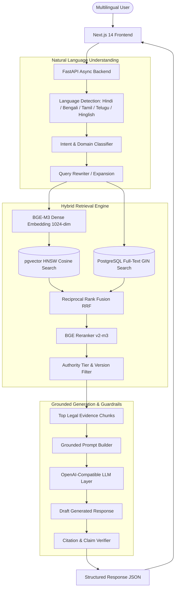

# IP-SAKTI Sahayak — Architecture & Subsystem Specification

## System Overview

IP-SAKTI Sahayak is a citation-first, multilingual legal AI guidance assistant designed specifically for the Indian Intellectual Property & Regulatory landscape. It enforces a strict architectural boundary:

> **The LLM Explains. The Verified Statutory Knowledge Base Provides The Evidence.**

---

## Key Subsystems

### 1. Controlled Source Registry (`data/metadata/source_registry.json`)
All ingested documents are restricted to Tier-1 official Indian government authorities:
- **Patents & Trademarks:** Controller General of Patents, Designs & Trade Marks (CGPDTM / IP India)
- **Copyright:** Copyright Office, Department for Promotion of Industry and Internal Trade (DPIIT)
- **Designs:** Patent Office (Designs Wing), Kolkata
- **Geographical Indications:** Geographical Indications Registry, Chennai
- **Startups & MSME:** Startup India Action Plan, DPIIT
- **Data Protection:** Ministry of Electronics and Information Technology (MeitY / DPDP Act 2023)

### 2. Section-Aware Legal Ingestion Pipeline
- **Extraction:** PyMuPDF text parsing with Tesseract OCR fallback for scanned gazettes.
- **Parsing:** Structural regex patterns detecting `CHAPTER`, `Section`, `Rule`, `Schedule`, `Form`, and `Article`.
- **Chunking:** Legal provisions serve as primary boundaries (500–1200 tokens target) preserving full hierarchy metadata (`Act`, `Chapter`, `Section`, `Rule`, `Page`, `Authority Tier`, `Version Status`).

### 3. Hybrid Retrieval & Reranking
- **Semantic:** Dense vector retrieval over `VECTOR(1024)` using cosine distance in PostgreSQL with an HNSW index (`m=16, ef_construction=64`).
- **Keyword:** PostgreSQL `tsvector` with `ts_rank_cd` and explicit section/rule number extractors.
- **Fusion:** Reciprocal Rank Fusion ($RRF = \sum \frac{1}{60 + \text{rank}}$) merges candidate pools.
- **Reranking:** Cross-encoder scoring via `BAAI/bge-reranker-v2-m3`.

### 4. Grounded LLM Layer & Citation Verification
- The system prompt forbids hallucinated citations, procedures, fees, or deadlines.
- If retrieval score is below the confidence threshold, the assistant gracefully falls back to an insufficient-evidence response directing users to the official statutory portal.
- All returned citations must resolve to actual database chunk records.
